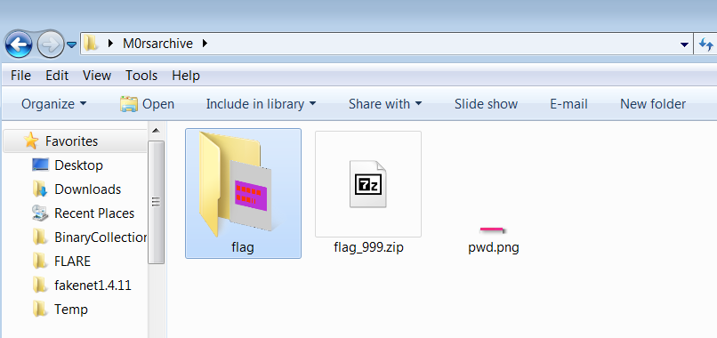

# m0rsarchive

Writeup and solve script for M0rsarchive Challenge on [HTB](https://app.hackthebox.com/challenges/m0rsarchive).

## Instructions and Challenge Overview

>Just unzip the archive ... several times ...

_archive password: `hackthebox`_

We are presented with a challenge archive. To directly run the script and get the flag (`~5`mins) depending on system specifications, extract the [archive](./assets/M0rsarchive.zip) with the archive password into this base directory (`m0rsarchive-writeup-master`) and run:
```
$ python solve.py
```

## Approach
- Based on the name of the challenge, I could deduce that the challenge had something to do with morse code and sure enough, upon unzipping the first "layer"/"level" of archive, I was presented with another archive and an image file.


Inspecting the image, I found that it resembled some pattern and then thought about the name of the challenge. It's name was also `pwd.png`, suggesting that it could be some form of password to extract the zip file (since unzipping the zip file without a password failed).


Thereafter, I went googling for potential tools that I could use to convert an image-based morse code to ASCII text and came across [this repository](https://github.com/eauxfolles/morse-ocr) and sure enough, I was able to get the "password" by modifying the script.

```python
...

image_file = input('Enter image file name to decode')

try:
    morse_image = Image.open(image_file)
except:
    print("error: could not open file")
    exit()
width, height = morse_image.size
pixel_data = morse_image.load()
background_color = pixel_data[0,0]

...
```

So instead of using `argv[1]` a.k.a. file name of the target image to be decoded to text (archive password), I used an input field.

Thereafter, I proceeded to write [an initial version of solve.py](./initial_solve.py) which calls the `decodeMorse` function in the helper `mocr.py`. The main purpose of `mocr.py` is to decode the image and return the "password" to `solve.py`, which does the actual extracting of each layer/level of archive.

I used a combination of ChatGPT and googling to find out that I could leverage the `zipfile.ZipFile(...).extractall()` method to extract the contents of each zip layer. I also noticed upon just extracting the first layer (using `pwd.png` as a password for `flag_999.zip`), 2 new files were extracted into a new directory, `flag/`.




So the file structure now looks something like this:

```
(cwd)
flag_999.zip
pwd.png
flag/
|-- flag_998.zip
|-- pwd.png
```

So I thought it would follow a pattern as such (i.e. the next layer would contain `flag_997.zip` and `pwd.png` in a subdirectory), but this wasn't the case when using my script (python's `ZipFile(...).extractall()` maybe?). Instead the third layer after extraction looked like this:

```
(cwd)
flag_999.zip
pwd.png
flag/
|-- flag_998.zip
|-- pwd.png (overwritten to store flag_997's password)
|-- flag_997.zip
```


So I modified the script to the [actual solve script](./solve.py), which takes into consideration this quirk only found on the second layer.

```python
from mocr import decodeMorse

def extract_files(level):
    while True:
        dir_path = 'flag/' * (level != 999) # exclude the dir_path only on first layer
        img_path = f"{dir_path}pwd.png"  # Set the image file path based on the level

        file_path = f"{dir_path}flag_{level}.zip"

        ### file path checking codes...

        password = decodeMorse(img_path)

        print(f"Extracting '{file_path}' with password: {password}")

        with zipfile.ZipFile(file_path, 'r') as zip_ref:
            try:
                zip_ref.extractall(pwd=password.encode())  # Provide the password to extract the contents
                ### successful extraction message (per level)...
                level -= 1

            # Exception handling and breaking at Level -1
            except Exception as e:
                print(f"Extraction failed at Level {level}: {e}")
                break  # Break the loop if extraction fails
```

And thereafter, I was able to find and read the contents of the flag file and so I included a printing functionality to the script too.


```python
flag_file = 'flag/flag' # Need to extract all zips before knowing this filename
if os.path.isfile(flag_file):
    with open(flag_file, 'r') as f:
        print(f"\nTHE FLAG IS: {f.read()}")
```

## Credits
[@eauxfolles](https://github.com/eauxfolles)